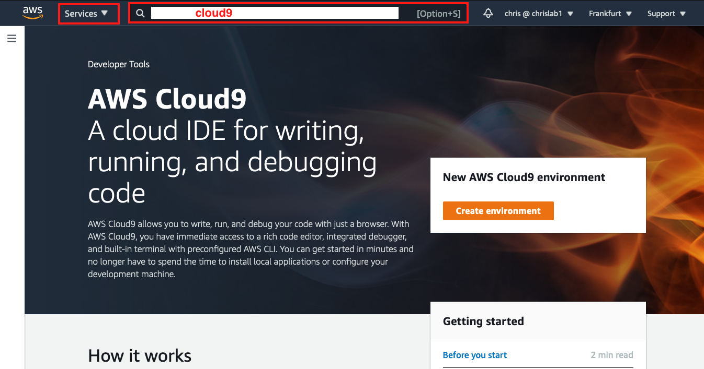
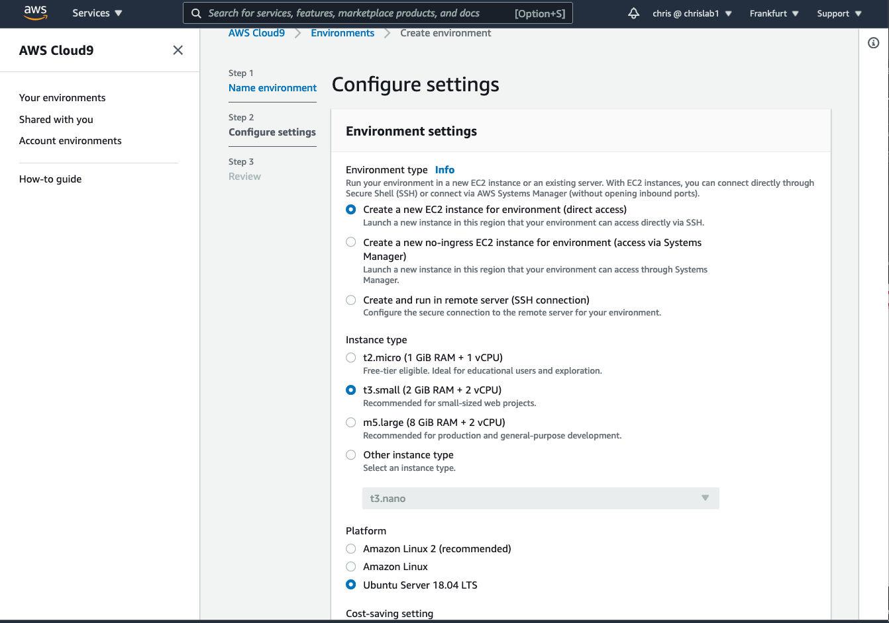
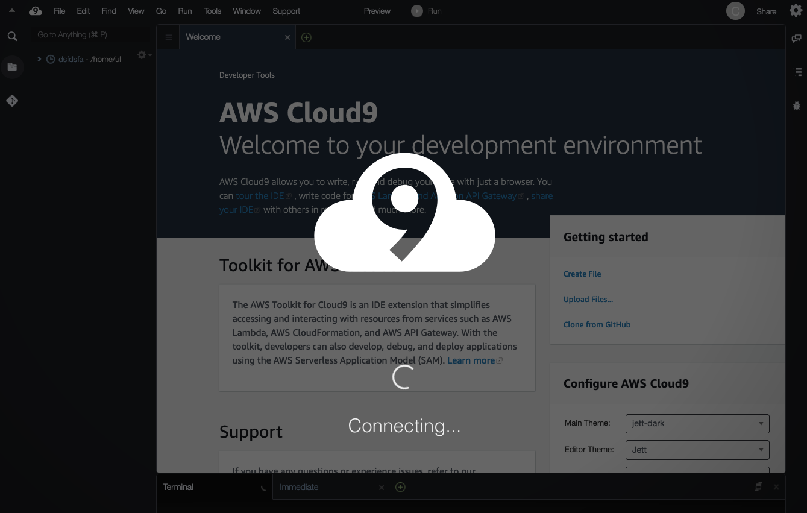
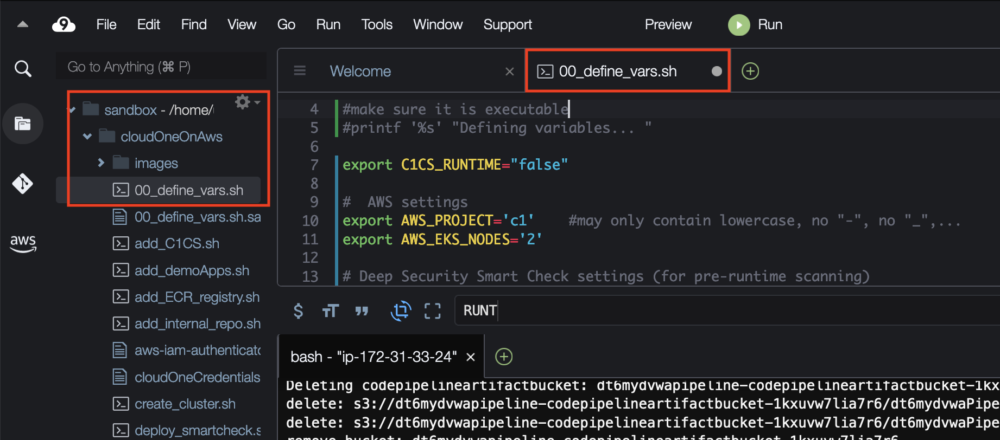

# Overview

This is a collaborative effort with mawinkler and nicgoth.
1. UPDATES: [20201126](#20201126)  [20210129](#20210129)  
2. [High level overview](#high-level-overview-of-steps-see-detailed-steps-in-next-section)  
3. [Detailed Steps](#detailed-setup-instructions)
4. [howToDemo.md](howToDemo.md) 


## UPDATES  
If this is your first time here, you can skip the "updates" section.  All changes are included in the documentation  
If you are a repeat visitor, then please check the updates below

### 20210325
- added the variable `C1CS_RUNTIME` to 00_define_vars.sh.sample
If you do not have access to C1CS-Runtime option (which is in preview now; March 2021), then set the following variable to "false".  
If this variable does not exist, it will be set to "true" (meaning you have access to C1CS-runtime)  This is for compatibility reasons with older versions of this script

### 20210215
1. The demo has been extended with Cloud One Container Security (both the Admission Controller and -in preview- the Runtime Security)
2. To make a better demo experience, pre-run 3 instances of the MoneyX pipeline.  This will allow for a smoother customer demo.    
  - the first one, with low security thresholds.  This pipeline is started by default and it will fail/stop before deploying the image to the registry
  - a second one with very high thresholds.  This pipeline will build the image, push it to the registry and even deploy a (very) vulnerable container from it.  Here we can ***demo runtime protection with Cloud One Application Security**.  This pipeline-instance will be started by running "./pushWithHighSecurityThresholds.sh"
  - a third pipeline instance where we include malware (eicar) in the MoneyX app. This pipeline-instance will build the image, push it to the registry (because we have also set high security thresholds here), and it will try to deploy a container from it.  Here the **admission controller of Cloud On Container Security** will kick in and prevent the deployment of the container.  This pipeline-instance should be started by running "./pushWithMalware.sh"  
  See the updated **howToDemo.md** document in this repo
3. Removed **pause.sh** and **resume.sh** because they have shown to be unreliable.  
### 20201126  
1. You now need to enter your DOCKERHUB_USERNAME and DOCKERHUB_PASSWORD in the 00_define_vars.sh file (may be a free account).  To deal with docker image pull rate-limits, the buildscipts of the Apps will now do authenticated pulls (to https://hub.docker.com) from the AWS pipeline.  This script passes along those variables to the buildspec.yml files
  For more info on the Dockerhub pull rate limits, see: https://www.docker.com/increase-rate-limits  Image Pulls for unauthenticated connections are now capped to 100 and for connections authenticated with a free account, they are capped to 200.  Both pull rates are for the last 6 hours (sliding window).  Paid dockerhub subscriptions have no pull rate limit.
2. The json structure that is returned by the command "eksctl get cluster" has apparently changed (the Name attribute is now part of a Metadata sub-structure).  This threw errors in the down.sh, pause.sh and resume.sh scripts.  These scripts have been adapted for this.  
3. The down.sh script has been enhanced to provide a better cleanup.


## In short, the script in this repo sets up:

- an AWS Elastic Kubernetes Service Cluster (EKS)
- an AWS codeCommit registry
- three AWS codePipelines
- Trend Micro "SmartCheck" and integrates it in the pipelines
- Trend Micro Cloud One Container Security
- Trend Micro Cloud One Application Security

Then it will:

- build 3 containers with runtime security by C1AS
- scan them with Smart Check for vulnerabilities, malware, sensitive content etc..
- and, if the risk is below the defined threshold:
  - push them to the ECR registry
  - deploy them on EKS
  - enable Admission Control with policies defines by C1CS
  

This README.md describes how to deploy the demo environment

Checkout the [howToDemo.md](howToDemo.md) for demo scenarios

- [Overview](#overview)
  - [UPDATES](#updates)
    - [20210325](#20210325)
    - [20210215](#20210215)
    - [20201126](#20201126)
  - [In short, the script in this repo sets up:](#in-short-the-script-in-this-repo-sets-up)
  - [High level overview of setup](#high-level-overview-of-setup)
  - [Detailed description for the setup](#detailed-description-for-the-setup)
    - [Requirements       -----DO READ-----](#requirements------------do-read-----)
      - [Shared AWS Accounts](#shared-aws-accounts)
    - [AWS Service Limits](#aws-service-limits)
    - [Prepare the environment](#prepare-the-environment)
      - [1. Setup an AWS Cloud9 environment](#1-setup-an-aws-cloud9-environment)
      - [2. Expand the disk space of the Cloud9 environment](#2-expand-the-disk-space-of-the-cloud9-environment)
      - [3. Disable the AWS-managed temporary credentials](#3-disable-the-aws-managed-temporary-credentials)
      - [4. Configure AWS CLI with your keys and region](#4-configure-aws-cli-with-your-keys-and-region)
      - [5. Clone this repository](#5-clone-this-repository)
      - [6. Configure `00_define_vars.sh`](#6-configure-00_define_varssh)
      - [7. run  `. ./up.sh` to deploy the environment](#7-run---upsh-to-deploy-the-environment)
    - [Next Step: How to Demo](#next-step-how-to-demo)
      - [8. Checkout howToDemo.md for a few typical demo scenarios](#8-checkout-howtodemomd-for-a-few-typical-demo-scenarios)
    - [Tear down](#tear-down)
  - [Common issues (WIP)](#common-issues-wip)
    - [Error: Kubernetes cluster unreachable](#error-kubernetes-cluster-unreachable)
    - [Error Code: AddressLimitExceeded](#error-code-addresslimitexceeded)
    - [Error: `fatal: unable to access 'https://git-codecommit.eu-central-1.amazonaws.com/v1/repos/<somerepo>.git/': The requested URL returned error: 403`](#error-fatal-unable-to-access-httpsgit-codecommiteu-central-1amazonawscomv1repossomerepogit-the-requested-url-returned-error-403)


## High level overview of setup 
1. Setup an AWS Cloud9 environment
2. Disable the AWS-managed temporary credentials
3. Configure AWS CLI with your keys and region
4. Clone this repository 
5. Configure `00_define_vars.sh`  
6. run  `. ./up.sh` to deploy the environment 
7. see [howToDemo.md](howToDemo.md) for demo scenarios
8. run ./down.sh to tear everything down

## Detailed description for the setup 

### Requirements       -----DO READ-----

#### Shared AWS Accounts

If you share an AWS account with a co-worker, make sure that you both use different project names and that one project name is not a subset of the other one: eg cloudone and cloudone01 would be bad, but cloudone01 and cloudone02 would be fine  (I know... there is room for improvement here)

### AWS Service Limits
The AWS Region that you will use must have:  
- **one "available" VPC "slot"**
   By default, there is a soft limit of 5 VPCs per region.  This script must be able to create 1 VPC. 
- **one "available" Elastic IP "slot"**
   By default, there is a soft limit of 5 Elastic IPs per region.  This script must be able to create 1 Elastic IP
- **one "available" Internet Gateway "slot"**
   By default, there is a soft limit of 5 Internet Gateways per region.  This script must be able to create 1 Internet Gateway  

AWS Service Limits can be increased by a simple (free) Support Request at: https://console.aws.amazon.com/support/home#/case/create -> Increase Service Levels    
The Cloud Formation Template to build the EKS cluster will crash if those resources cannot be created

The IAM User account that you will use:

- must have **Programmatic Access** as well as **AWS Management Console Access**
- must have **AdministratorAccess** permissions (AWS console -> Services -> IAM -> Users -> click on the user -> Permissions tab -> If AdministratorAccess is not there, then click on Add permissions and add it; or request the rights from you Admin)  The reason is that the script will not only create an EKS cluster, but also a lot of other things, like create  VPC, subnets, routetables, roles, IPs, S3 buckets, ...

(trial) Licenses
You will need the following licenses:
- **A license for SmartCheck**  If you don't have a license key yet, you can get one here: <https://www.trendmicro.com/product_trials/download/index/us/168>
- **CloudOne (Application Security) Account**  You can register for a trial here: <https://cloudone.trendmicro.com/_workload_iframe//SignUp.screen>  In CloudOne Application Security, you will need to create a "group" for the MoneyX application.  This will give you a **key** and a **secret** that you can use for the TREND_AP_KEY and TREND_AP_SECRET variables in this script.  

### Prepare the environment

#### 1. Setup an AWS Cloud9 environment
  - login to the AWS console 
  - select the region you want to work in (from the dropdown at the right top of the screen)
  - go to Cloud9 (either use the drop-down labelled "services" and select Cloud9, or in the search bar enter "Cloud9")
  
  - Create an Environment
  - Give it a name to your liking and click "Next Step"  
  - As indicated in the screenshot below, make the following selections
  - select `Create a new EC2 instance for environment (direct access)`
  - use `t3.small`  (!)
  - use `Ubuntu Server 18.04 LTS`  (!)
    
  - tag it to your liking (tags are good)
  - use default settings for the rest (click "Next Step" and "Create Environment")
  - The creation of the new environment may take 2-3 minutes.  Occasionally we have seen where the enviroment could not be created.  In that case, delete it an create a new one (AWS -> Services -> Cloud9 -> My Enviroments)
  

<!--0. <not needed?>
Create an AWS Role to allow the EKS worker nodes (EC2 instances) to connect to ECR  
 - AWS Services -> IAM -> Roles -> Create Role
 - Select type of trusted entity: AWS Services
 - Choose a use case: EC2 -> Next: Permissions
 - Assign permission policy : "AmazonEC2ContainerRegistryFullAccess" -> Next: Tags
 - -> Next Role name: e.g. project_name_EC2_access_to_ECR  
  -->

<!-- 0. Grant the Cloud9 environment Administrator Access
- Click the following deep to create the Role for Cloud9:
https://console.aws.amazon.com/iam/home#/roles$new?step=review&commonUseCase=EC2%2BEC2&selectedUseCase=EC2&policies=arn:aws:iam::aws:policy%2FAdministratorAccess
- Name it Cloud9EC2AdminAccess
- Attach the IAM role Cloud9EC2AdminAccess to the ec2 instance of your Cloud9:
  * In the AWS Console, go to Services -> EC2 -> select the EC2 instance used for this Cloud9 -> Actions -> Instance Settings -> Attach/Replace IAM Role
* Within Cloud9 Preferences -> AWS Settings -> Credentials -> AWS managed temporary credentials -> Disable
-->

#### 2. Expand the disk space of the Cloud9 environment
Our Cloud9 environment only has 10Gb of disk space.  
Let's resize it to 40GB
Credits to @mawinkler for adapting this AWS script

```
df -h   #notice the line /dev/nvme0n1p1 says 9.7G
./resize.sh 40
df -h   #notice the line /dev/nvme0n1p1 now says 39G 
```

#### 3. Disable the AWS-managed temporary credentials
In the Cloud9 environment, go to the Cloud9 menu bar and click on the AWS Cloud9 tab (it shows the number 9 in a cloud icon).   If you don't see the menu bar as indicated in the screenshot below, hover the mouse over the top of the window. The menu bar should roll down and become visible.  Go to -> Preferences -> scroll down and expand "AWS Settings" (not AWS Configuration)-> Credentials -> uncheck "AWS managed temporary credentials"


#### 4. Configure AWS CLI with your keys and region
   
```shell
aws configure
```

Please set `Default region` to the region you're working on and default the output format to `json`.

```shell
AWS Access Key ID [****************GT7G]:   type your AWS Access Key here
AWS Secret Access Key [****************0LQy]:  type your AWS Secret Access key here
Default region name [eu-central-1]:    Configure your region here
Default output format [json]:          Set default output to json
```

<!--4. Create credentials for CodeCommit  
CodeCommit requires AWS Key Management Service. If you are using an existing IAM user, make sure there are no policies attached to the user that expressly deny the AWS KMS actions required by CodeCommit. For more information, see AWS KMS and encryption.
- In the AWS console, go to Services and choose IAM, then go to Users, and then click on the IAM user you want to configure for CodeCommit access.
- On the Permissions tab, choose Add Permissions.
- In Grant permissions, choose Attach existing policies directly.
- From the list of policies, select AWSCodeCommitPowerUser or another managed policy for CodeCommit access.
- Click "Next: Review" to review the list of policies to attach to the IAM user.
- If the list is correct, choose Add permissions.

see also:
https://docs.aws.amazon.com/codecommit/latest/userguide/setting-up-gc.html?icmpid=docs_acc_console_connect_np
-->

#### 5. Clone this repository 
In your Cloud9 environment, run the following command to clone this repository:

```shell
git clone https://github.com/cvdabbeele/cloudOneOnAWS.git
cd cloudOneOnAWS
```

#### 6. Configure `00_define_vars.sh`    
Copy the sample file  
```shell
cp 00_define_vars.sh.sample 00_define_vars.sh
```

Edit the `00_define_vars.sh` file with the built in editor  
>  


1. Update the following variables:
- `DSSC_AC`           # your SmartCheck activation key
- `TREND_AP_KEY`      # your AP key created in C1AS by adding a "group" for MoneyX 
- `TREND_AP_SECRET`   # your AP secret created in C1AS by adding a "group" for MoneyX 
- `C1API_KEY`         # API key created in C1WS (Role= Full Access)
- `DOCKERHUB_USERNAME`
- `DOCKERHUB_PASSWORD`

2. `AWS_PROJECT` and shared AWS accounts:
- If you are sharing an AWS account with someone else, make sure that both of you use a different AWS_PROJECT name.  
- Also, one project name **may not be a subset of the other**.  e.g. c1 and c1b would be bad, but c1a and c1b would be good.
- To make sure that you do not "see" each other's projects, pipelines, clusters, registries etc, it is best to both use a **different AWS region**  

3. Preview of the RUNTIME-protection option of Cloud One Workload Security
The script assumes that you have access to the C1WS-RUNTIME option.  
If you do NOT have access to it, then add/uncomment the following line to/in your 00_define_vars.sh:  
`export C1CS_RUNTIME="false"`
If this line does not exist, the script will default that variable to `true`  (This is for backward compatibility with earlier versions of this script)
  
The rest are preconfigured (default) variables which you do not need to change.  However, you may want to change the `DSSC_PASSWORD` as well.

#### 7. run  `. ./up.sh` to deploy the environment 

Important: don't forget the first dot :-)

```shell
. ./up.sh
```

This will do the following:

6.1. Install the essential tools like `eksctl`, `jq`, etc.

```shell
--------------------------
        Tools
--------------------------
installing jq
Reading package lists... Done
Building dependency tree
Reading state information... Done
jq is already the newest version (1.5+dfsg-2).
0 upgraded, 0 newly installed, 0 to remove and 4 not upgraded.
installing kubectl....installing eksctl....
renamed '/tmp/eksctl' -> '/usr/local/bin/eksctl'
installing helm....
Downloading https://get.helm.sh/helm-v3.2.4-linux-amd64.tar.gz
Preparing to install helm into /usr/local/bin
helm installed into /usr/local/bin/helm
version.BuildInfo{Version:"v3.2.4", GitCommit:"0ad800ef43d3b826f31a5ad8dfbb4fe05d143688", GitTreeState:"clean", GoVersion:"go1.13.12"}
installing AWS authenticator....
  % Total    % Received % Xferd  Average Speed   Time    Time     Time  Current
                                 Dload  Upload   Total   Spent    Left  Speed
100 33.6M  100 33.6M    0     0  6633k      0  0:00:05  0:00:05 --:--:-- 7094k
```

6.2. Create an EKS cluster

```shell
-----------------------
 Creating EKS cluster
-----------------------
Creating file: cloudone01EksCluster.yml...
Creating a 2-node eks cluster named: cloudone01 in region eu-central-1
This may take up to 20 minutes... (started at:Mon Jul 20 07:44:39 UTC 2020)
[ℹ]  eksctl version 0.24.0
[ℹ]  using region eu-central-1
[ℹ]  setting availability zones to [eu-central-1c eu-central-1a eu-central-1b]
[ℹ]  subnets for eu-central-1c - public:192.168.0.0/19 private:192.168.96.0/19
[ℹ]  subnets for eu-central-1a - public:192.168.32.0/19 private:192.168.128.0/19
[ℹ]  subnets for eu-central-1b - public:192.168.64.0/19 private:192.168.160.0/19
[ℹ]  using Kubernetes version 1.16
[ℹ]  creating EKS cluster "cloudone01" in "eu-central-1" region with managed nodes
[ℹ]  1 nodegroup (nodegroup) was included (based on the include/exclude rules)
[ℹ]  will create a CloudFormation stack for cluster itself and 0 nodegroup stack(s)
[ℹ]  will create a CloudFormation stack for cluster itself and 1 managed nodegroup stack(s)
[ℹ]  if you encounter any issues, check CloudFormation console or try 'eksctl utils describe-stacks --region=eu-central-1 --cluster=cloudone01'
[ℹ]  CloudWatch logging will not be enabled for cluster "cloudone01" in "eu-central-1"
[ℹ]  you can enable it with 'eksctl utils update-cluster-logging --region=eu-central-1 --cluster=cloudone01'
[ℹ]  Kubernetes API endpoint access will use default of {publicAccess=true, privateAccess=false} for cluster "cloudone01" in "eu-central-1"
[ℹ]  2 sequential tasks: { create cluster control plane "cloudone01", 2 sequential sub-tasks: { no tasks, create managed nodegroup "nodegroup" } }
[ℹ]  building cluster stack "eksctl-cloudone01-cluster"
[ℹ]  deploying stack "eksctl-cloudone01-cluster"
[ℹ]  building managed nodegroup stack "eksctl-cloudone01-nodegroup-nodegroup"
[ℹ]  deploying stack "eksctl-cloudone01-nodegroup-nodegroup"

[ℹ]  waiting for the control plane availability...
[✔]  saved kubeconfig as "/home/ubuntu/.kube/config"
[ℹ]  no tasks
[✔]  all EKS cluster resources for "cloudone01" have been created
[ℹ]  nodegroup "nodegroup" has 2 node(s)
[ℹ]  node "ip-192-168-7-126.eu-central-1.compute.internal" is ready
[ℹ]  node "ip-192-168-84-105.eu-central-1.compute.internal" is ready
[ℹ]  waiting for at least 2 node(s) to become ready in "nodegroup"
[ℹ]  nodegroup "nodegroup" has 2 node(s)
[ℹ]  node "ip-192-168-7-126.eu-central-1.compute.internal" is ready
[ℹ]  node "ip-192-168-84-105.eu-central-1.compute.internal" is ready
[ℹ]  kubectl command should work with "/home/ubuntu/.kube/config", try 'kubectl get nodes'
[✔]  EKS cluster "cloudone01" in "eu-central-1" region is ready
Cloudformation Stacks deployed.  Elapsed time: 15 minutes
Checking EKS cluster.  You should see your EKS cluster in the list below
NAME            REGION
cloudone01      eu-central-1
```

6.3. Install Smart Check with internal registry

```shell
------------------------------
 Cloud One Container Security
------------------------------
Creating namespace smartcheck...namespace/smartcheck created
Creating certificate for loadballancer...Generating a RSA private key
....................................................................................................++++
.....................++++
writing new private key to 'k8s.key'
-----
Creating secret with keys in Kubernetes...secret/k8s-certificate created
Creating overrides.yml file
Deploying Helm chart...

Waiting for Cloud One Container Security to come online: ........  
Doing initial (required) password change
You can login:  
--------------
     URL: https://a1837449ce2db4dcf8a56d955208c8dc-263324481.eu-central-1.elb.amazonaws.com
     user: administrator
     passw: trendmicro
--------------
```

6.4. Add the internal Repository plus a demo Repository to Smart Check

```shell
-------------------------------------------------------------
 Adding internal repository to Cloud One Container Security  
-------------------------------------------------------------
--------------------------------------------------------
 Adding Demo repository to Cloud One Container Security
--------------------------------------------------------
    Adding demo repository with filter: {*photo*}
```

6.5. Setup demo pipelines

```shell
-------------------------------
Creating CodeBuild pipelines
-------------------------------
Patching aws-auth configmap for cloudone01
configmap/aws-auth patched
No environment found:
--------------------------
   CodeCommit repo:  exists = false
   CloudFormation stack:  status =
   CodePipeline:  exists = false
   ECR repo:  exists = false
creating: CodeCommit repository , ECR repository , Pipeline cloudone01c1appsecmoneyx and Cloudformation stack
Creating file: cloudone01c1appsecmoneyxPipeline.yml
Creating Cloudformation Stack and Pipeline cloudone01c1appsecmoneyx...
^[cWaiting for Cloudformation stack cloudone01c1appsecmoneyxPipeline to be created.
No environment found:
--------------------------
   CodeCommit repo:  exists = false
   CloudFormation stack:  status =
   CodePipeline:  exists = false
   ECR repo:  exists = false
creating: CodeCommit repository , ECR repository , Pipeline cloudone01troopers and Cloudformation stack
Creating file: cloudone01troopersPipeline.yml
Creating Cloudformation Stack and Pipeline cloudone01troopers...
Waiting for Cloudformation stack cloudone01troopersPipeline to be created.
No environment found:
--------------------------
   CodeCommit repo:  exists = false
   CloudFormation stack:  status =
   CodePipeline:  exists = false
   ECR repo:  exists = false
creating: CodeCommit repository , ECR repository , Pipeline cloudone01mydvwa and Cloudformation stack
Creating file: cloudone01mydvwaPipeline.yml
Creating Cloudformation Stack and Pipeline cloudone01mydvwa...
Waiting for Cloudformation stack cloudone01mydvwaPipeline to be created.
```

6.6. Git-clone 3 demo applications
At the same level as the project directory (cloudOneOnAWS), an "apps" directory will be created.

```shell
---------------------
 Adding Demo-apps
---------------------
Deploying c1appsecmoneyx (from https://github.com/cvdabbeele/c1-app-sec-moneyx.git)
---------------------------------------------
Importing c1-app-sec-moneyx from public git
Cloning into 'c1-app-sec-moneyx'...
remote: Enumerating objects: 113, done.
remote: Counting objects: 100% (113/113), done.
remote: Compressing objects: 100% (79/79), done.
remote: Total 113 (delta 62), reused 82 (delta 32), pack-reused 0
Receiving objects: 100% (113/113), 15.87 KiB | 1.22 MiB/s, done.
Resolving deltas: 100% (62/62), done.
Deleting c1-app-sec-moneyx/.git directory (.git from github)
initializing git for CodeCommit
Initialized empty Git repository in /home/ubuntu/environment/apps/c1-app-sec-moneyx/.git/
generating a dummy change to trigger a pipeline
updating CodeCommit repository
[master (root-commit) e070204] commit by "add_demoApps"
 7 files changed, 324 insertions(+)
 create mode 100644 Dockerfile
 create mode 100644 Jenkinsfile
 create mode 100644 README.md
 create mode 100644 app-eks.yml
 create mode 100644 app.yml
 create mode 100644 buildspec.yml
 create mode 100644 exploits.md
Counting objects: 9, done.
Compressing objects: 100% (9/9), done.
Writing objects: 100% (9/9), 4.57 KiB | 1.52 MiB/s, done.
Total 9 (delta 1), reused 0 (delta 0)
To https://git-codecommit.eu-central-1.amazonaws.com/v1/repos/cloudone01c1appsecmoneyx.git
 * [new branch]      master -> master
Branch 'master' set up to track remote branch 'master' from 'origin'.
Everything up-to-date
Deploying troopers (from https://github.com/cvdabbeele/troopers.git)
---------------------------------------------
Importing troopers from public git
Cloning into 'troopers'...
remote: Enumerating objects: 24, done.
remote: Counting objects: 100% (24/24), done.
remote: Compressing objects: 100% (17/17), done.
remote: Total 215 (delta 12), reused 18 (delta 7), pack-reused 191
Receiving objects: 100% (215/215), 1.07 MiB | 2.30 MiB/s, done.
Resolving deltas: 100% (121/121), done.
Deleting troopers/.git directory (.git from github)
initializing git for CodeCommit
Initialized empty Git repository in /home/ubuntu/environment/apps/troopers/.git/
generating a dummy change to trigger a pipeline
updating CodeCommit repository
[master (root-commit) d5c2be9] commit by "add_demoApps"
 22 files changed, 1005 insertions(+)
 create mode 100644 .dockerignore
 create mode 100644 Dockerfile
 create mode 100644 Jenkinsfile
 create mode 100644 LICENSE
 create mode 100644 README.md
 create mode 100644 app-eks.yml
 create mode 100644 app.py
 create mode 100644 app.yml
 create mode 100644 buildspec.yml
 create mode 100644 requirements.txt
 create mode 100644 smartcheck.snippet
 create mode 100644 static/photo-1472457847783-3d10540b03d7.jpeg
 create mode 100644 static/photo-1472457897821-70d3819a0e24.jpeg
 create mode 100644 static/photo-1472457974886-0ebcd59440cc.jpeg
 create mode 100644 static/photo-1484656551321-a1161420a2a0.jpeg
 create mode 100644 static/photo-1484824823018-c36f00489002.jpeg
 create mode 100644 static/photo-1518331368925-fd8d678778e0.jpeg
 create mode 100644 static/photo-1518331483807-f6adb0e1ad23.jpeg
 create mode 100644 static/photo-1544816565-aa8c1166648f.jpeg
 create mode 100644 static/photo-1547700055-b61cacebece9.jpeg
 create mode 100644 static/photo-1558492426-df14e290aefa.jpeg
 create mode 100644 templates/index.html
Counting objects: 26, done.
Compressing objects: 100% (22/22), done.
Writing objects: 100% (26/26), 1.05 MiB | 17.84 MiB/s, done.
Total 26 (delta 1), reused 0 (delta 0)
To https://git-codecommit.eu-central-1.amazonaws.com/v1/repos/cloudone01troopers.git
 * [new branch]      master -> master
Branch 'master' set up to track remote branch 'master' from 'origin'.
Everything up-to-date
Deploying mydvwa (from https://github.com/cvdabbeele/mydvwa.git)
---------------------------------------------
Importing mydvwa from public git
Cloning into 'mydvwa'...
remote: Enumerating objects: 152, done.
remote: Counting objects: 100% (152/152), done.
remote: Compressing objects: 100% (106/106), done.
remote: Total 152 (delta 79), reused 114 (delta 43), pack-reused 0
Receiving objects: 100% (152/152), 18.50 KiB | 1.32 MiB/s, done.
Resolving deltas: 100% (79/79), done.
Deleting mydvwa/.git directory (.git from github)
initializing git for CodeCommit
Initialized empty Git repository in /home/ubuntu/environment/apps/mydvwa/.git/
generating a dummy change to trigger a pipeline
updating CodeCommit repository
[master (root-commit) 19bce80] commit by "add_demoApps"
 6 files changed, 251 insertions(+)
 create mode 100644 Dockerfile
 create mode 100644 Jenkinsfile
 create mode 100644 README.md
 create mode 100644 app-eks.yml
 create mode 100644 app.yml
 create mode 100644 buildspec.yml
Counting objects: 8, done.
Compressing objects: 100% (7/7), done.
Writing objects: 100% (8/8), 3.38 KiB | 1.69 MiB/s, done.
Total 8 (delta 1), reused 0 (delta 0)
To https://git-codecommit.eu-central-1.amazonaws.com/v1/repos/cloudone01mydvwa.git
 * [new branch]      master -> master
Branch 'master' set up to track remote branch 'master' from 'origin'.
Everything up-to-date
...
```

Hereunder, 3 app-repos will be git-cloned from the public github (`c1appsecmoneyx`, `troopers` and `mydvwa`).

```shell
markus:~/environment/cloudOneOnAWS (master) $ ls -l ../apps/
total 12
drwxrwxr-x 3 ubuntu ubuntu 4096 Jul 20 08:06 c1-app-sec-moneyx
drwxrwxr-x 3 ubuntu ubuntu 4096 Jul 20 08:07 mydvwa
drwxrwxr-x 5 ubuntu ubuntu 4096 Jul 20 08:06 troopers
```

Those apps will be pushed to the AWS CodeCommit repository of the project
 and an AWS CodeBuild process to build the applications is triggered.

By default:

- the **troopers** app will be deployed to the EKS cluster because it is clean
- the **c1-app-sec-moneyx** and the **mydvwa** apps will not be deployed because they have too many vulnerabilities

If you encounter any **errors**, please check the "common issues" section at the bottom  

Verify that the pipelines are being started (AWS Console -> Services:CodePipeline -> Pipelines)


### Next Step: How to Demo

#### 8. Checkout [howToDemo.md](howToDemo.md) for a few typical demo scenarios  

### Tear down  

```shell
./down.sh
```

To avoid excessive costs when not using the demo environment, tear-down the environment.  The ./down.sh script will delete the EKS cluster, the EC2 instances, Cloudformation Stacks, Roles, VPCs, Subnets, S3buckets,....  
The Cloud9 EC2 instance will stop, but remain available for later.  

To start the enviroment again, simply reconnect to the Cloud9 environment and run **./up.sh**  This will redeploy everything from scratch


## Common issues (WIP)

### Error: Kubernetes cluster unreachable

`The connection to the server localhost:8080 was refused - did you specify the right host or port?`

Verify your AWS_PROJECT variable. It may only contain **lowercase and trailing numbers**, but :

- no uppercase
- no " - "
- no " _ "
- nor any special characters

This variable is used for several purposes and each of them have their own restrictions,..which add up to "only a-z lowercase and numbers"  It may also not begin with a number.

### Error Code: AddressLimitExceeded


Ensure that you can create Elastic IPs in this region.
By default, there is a (soft) limit of 5 Elastic IPs per AWS region.

### Error: `fatal: unable to access 'https://git-codecommit.eu-central-1.amazonaws.com/v1/repos/<somerepo>.git/': The requested URL returned error: 403`

This has to do wich the credential helper and the environment which is created by the `up.sh`. Very likely you forgot the first `.`when running `up.sh`.  
So please rerun

```shell
. ./up.sh
```

Afterwards you will be able to commit changes to your CodeCommit repositories.
