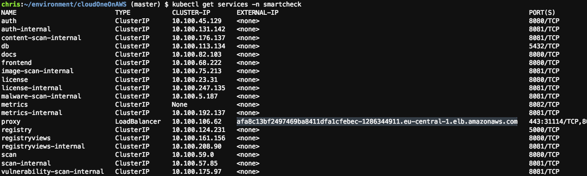
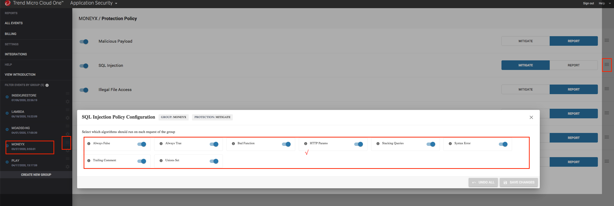

# How to Demo (wip)

## Preparation for the Demo

In this demo scenario we will be using the MoneyX demo application.  
This is the only app that has the runtime protection enabled

Login to your CloudOne account and go to Cloud One Application Security.  <br />
Find the group that you created for the MoneyX application (c1-app-sec-moneyx).  <br />
Open Polcies" and set all policies to REPORT <br />

In AWS, under CodePipeline -> Pipelines -> make sure you have a failed pipeline for the <projectname>c1appsecmoneyxPipeline  <br />

Open the following browser tabs:
- your Cloud9 shell,
- codePipeline,
- DSSC,
- MoneyX,
- C1AS,
- CloudFormation,

## Demo Scenario
- show the 3 AWS CodeCommit repositories
- show the AWS pipelines -> click on the failed c1appsecmoneyx pipeline and scroll all the way down. <br />
  Show why this pipeline failed (see "Vulnerabilities exceeded threshold" in screenshot below)   <br />
- in Cloud9 type `eksctl get clusters` and show that you have an EKS cluster
- type `kubectl get pods --namespace smartcheck` and show the pods used by smartcheck.  Also show the deployments `kubectl get deployments -n smartcheck`
- type `kubectl get services -n smartcheck` and copy the URL of the proxy service as indicated in the screenshot below  <br />
- Then open a browser to that url
(e.g. https://afa8c13bf2497469ba8411dfa1cfebec-1286344911.eu-central-1.elb.amazonaws.com )
- show scanfindings in DSSC <br />

### Story: We have to deploy with vulnerabilities
For an urgent Marketing event, the "business" wants us to put this application online ASAP.  Our code is fine, the vulnerabilities are in the external libraries that we have used and we don't know how to quickly fix them.  

As a work-around, we will deploy the app with vulnerabilities and rely on runtime protection (CloudOne Application Control)
```
cd ~/environment/cloudOneOnAWS/
vi buildspec.yaml
```
bump up thresholds for vulnerabilities as indicated in the screenshot below   <br />
```
git add .
git commit -m "removed safety thresholds"
git push
```
while the pipeline is building;
explore the buildspec.yaml and the Dockerfile
```
kubectl get pods -n smartcheck
kubectl get deployments -n smartcheck
kubectl get services -n smartcheck
kubectl get pods
```
The last command will tell you if any of the new apps got deployed

When you get a successful pipeline

Walk through the scanresults in SmartCheck and notice that we still have a vulnerable image

```
kubctl get pods
```
Notice that the MoneyX pod is new
```
kubectl get services
```
Notice the URL and port (8080) of the MoneyX app.

### Attack and Protect the running app:
login to the MoneyX app:  
- username = "user"
- password = "user123"

Go to Received Payments.  You see no received payments.  

Go to the URL window at the top of the browser and add to the end of the url:  " or 1=1" (without the quotes)
e.g.
```
http://a091a4276fe2d48009ecee19c6c64981-609291530.eu-central-1.elb.amazonaws.com:8080/payment/list-received/ or 1=1
```

You should now see ALL payments... which is bad

Go to https://cloudone.trendmicro.com/application#/events show that there is a security event for SQL injection

Check security events in CloudOne Application Security

Set the SQL Injection policy to MITIGATE

**important:** <br />
Open the SQL Injection Policy and enable all subsections as indicated in the screenshot below.
  <br />


Run the SQL injection again  (just refresh the browser page) You should get our super fancy blocking page as indicated in the screenshot below
  <br />

### Walk through how Cloud 1 Application Control was setup

In AWS codecommit: show the Dockerfile
point out:
- ADD command: library is imported (in this case it is a java app, so we added the java library)
- CMD -> library inserted.  Here we invoke the imported library

The Registration keys for Cloud One Application Security must be called at runtime.  You can show those in the Cloud Formation Template -> Tab:Template ->search appSec registration keys for AppSec
