# How to Demo

- [How to Demo](#how-to-demo)
  - [Prepare for the Demo](#prepare-for-the-demo)
  - [Demo AWS pipeline integrations with SmartCheck](#demo-aws-pipeline-integrations-with-smartcheck)
  - [Demo CloudOne Application Security (C1AS)](#demo-cloudone-application-security-c1as)
    - [Attack and Protect the running container](#attack-and-protect-the-running-container)
    - [Walk through the integration with CloudOne Application Control](#walk-through-the-integration-with-cloudone-application-control)
  - [Walk through CloudOne Container Security (Admission Control)](#walk-through-cloudone-container-security-admission-control)

## Prepare for the Demo

In this demo scenario we will be using the MoneyX demo application. `This is the only app that has the runtime protection enabled`.

Login to your CloudOne account (https://cloudone.trendmicro.com/ ) and go to `Application Security`.  In the left margin, find the group that you created for the MoneyX application (`c1-app-sec-moneyx`).

Open `Policies` and set all policies to `REPORT`.

In AWS, under Services -> CodePipeline -> `Pipelines` -> make sure you have a **failed** pipeline for the `cloudone01c1appsecmoneyxPipeline`

Ensure to have the following browser tabs opened and authenticated.

- CloudOne Application Security
- SmartCheck
- AWS Service CodePipeline / CodeCommit
- Your Cloud9 shell

## Demo AWS pipeline integrations with SmartCheck

- Show the EKS cluster  
  In Cloud9 type:
```shell
eksctl get clusters
```

 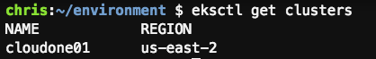

- Show the pods used by smartcheck
```shell
kubectl get pods --namespace smartcheck
```  
- Point out when we say that we "scan" an image, we actually have 5 different scanners scanning the image for for specific things  
```shell
kubectl get pods --namespace smartcheck | grep -i scan
```
  

- Also show the deployments
```shell
kubectl get deployments -n smartcheck
```
    Deployments ensure that always a given number of instances of each pod is running (in our case this default is 1) but this can be scaled by the usual kubernetes commands.
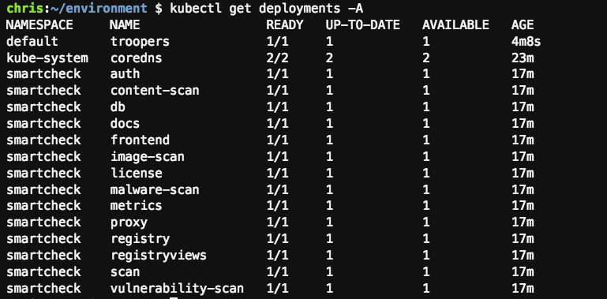

- To find the SmartCheck URL, we need to get the "services". Type

```shell
kubectl get svc -n smartcheck 
```
or more detailed:
```shell
kubectl get svc -n smartcheck proxy  -o jsonpath='{.status.loadBalancer.ingress[0].hostname}'
```
and open a browser to that url
(e.g. <https://afa8c13bf2497469ba8411dfa1cfebec-1286344911.eu-central-1.elb.amazonaws.com>)

- Login to SmartCheck with the username/password that you have defined in the ))_define_vars.sh file and show/discuss:
  - the Smart Check dashboard
  - the connected registries and point out how easy it is to add a registry and get full visibility on the security posture of the container-images (you only need the url and credentials with Read-Only rights)
  - the scanfindings

- If (optionally) you want to dive a little deeper you can:  
  - also show that we enforce microsegmentation between the pods.   
  Show the network policies:
    ```shell
    kubectl get networkpolicies -n smartcheck
    ```  

    for example, for the proxy pod we have the following network policy  
  - point out that SmartCheck is deployed using a helm chart with one, single, command.   
    To check the version of the deployed SmartCheck, run:   
    ```shell
    helm list -n $DSSC_NAMESPACE
    ```    
    To deploy smartcheck, one would only run:  
    ```shell
    helm install -n $DSSC_NAMESPACE --values overrides.yml deepsecurity-smartcheck https://github.com/deep-security/smartcheck-helm/archive/master.tar.gz
    ```
    To upgrade smartcheck, one would only run:   
    ```shell
    helm install -n $DSSC_NAMESPACE --values overrides.yml deepsecurity-smartcheck https://github.com/deep-security/smartcheck-helm/archive/master.tar.gz
    ```   

- back to the main demo scenario:  
Show the 3 AWS CodeCommit repositories (AWS -> Services -> CodeCommit -> Repositories) 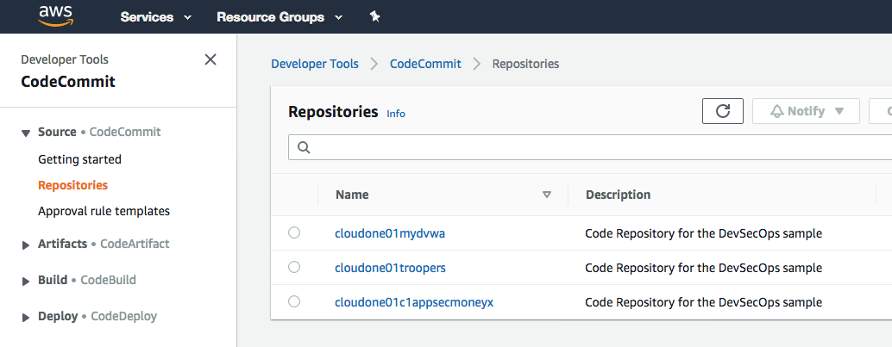

- show the AWS pipelines (on the same page: Pipeline -> Pipelines)
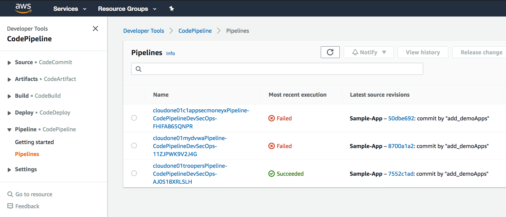
- click on the failed c1appsecmoneyx pipeline -> BuildAndScan -> click on "Details"

- and scroll all the way down.
- show where the smartcheck-scan-action container is started
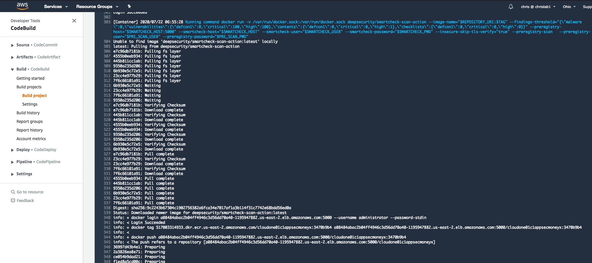
- show where the pipeline is waiting for the can results
 
- and SmartCheck is scanning the container-image: 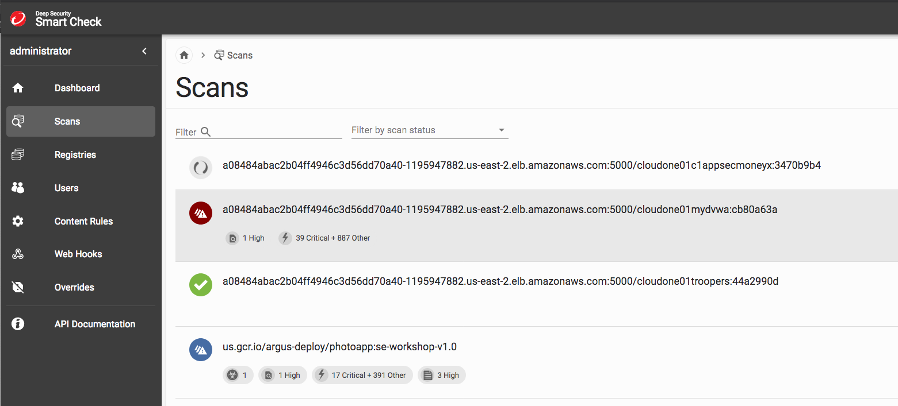
- walk through the scan results
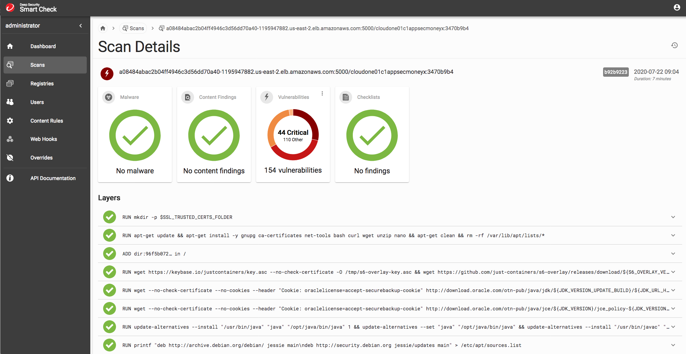
- and specifically point out the Snyk Java scan results.  This is something that will not show up in e.g. the Clair Open Source scanner
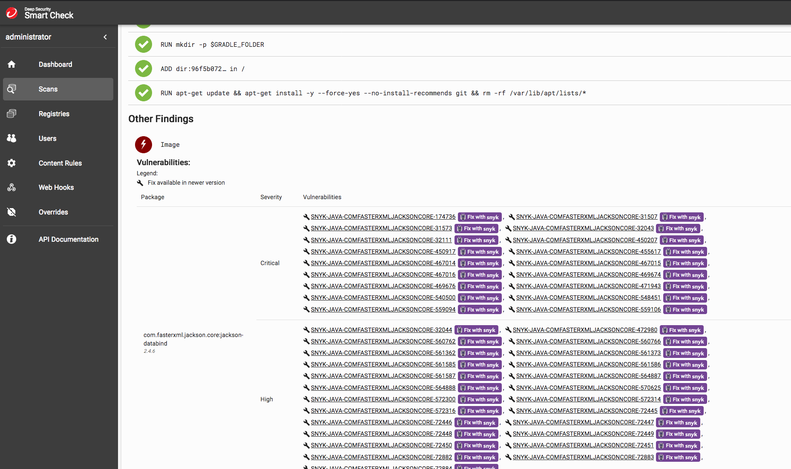
- show why this pipeline failed (see "Vulnerabilities exceeded threshold" in screenshot below) 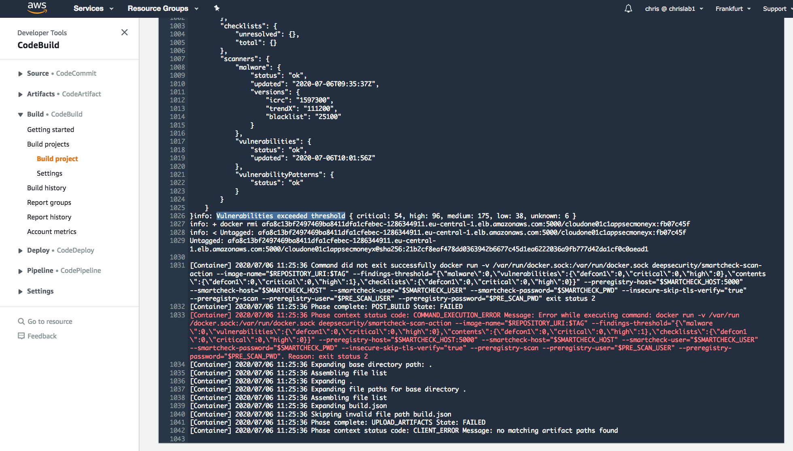  

- The above integration ensures that only "clean" images can get published in our ECR registry

## Demo CloudOne Application Security (C1AS)
Story: We have to deploy with vulnerabilities

*For an urgent Marketing event, the "business" wants us to put this application online ASAP.  Our code is fine, but we have found vulnerabilities in the external libraries that we have used and we don't know how to quickly fix them (or the fixes are not yet available).*  

As a work-around, we will deploy the app with vulnerabilities and rely on runtime protection (CloudOne Application Security)

```shell
cd ~/environment/apps/c1-app-sec-moneyx/
```

Edit the buildspec.yml.   
Bump up thresholds for vulnerabilities as indicated below.  
You can use the build-in editor of cloud9

```yaml
        ...
        --findings-threshold="{\"malware\":0,\"vulnerabilities\":{\"defcon1\":0,\"critical\":100,\"high\":200},\"contents\":{\"defcon1\":0,\"critical\":0,\"high\":1},\"checklists\":{\"defcon1\":0,\"critical\":0,\"high\":0}}"
        ...
```
 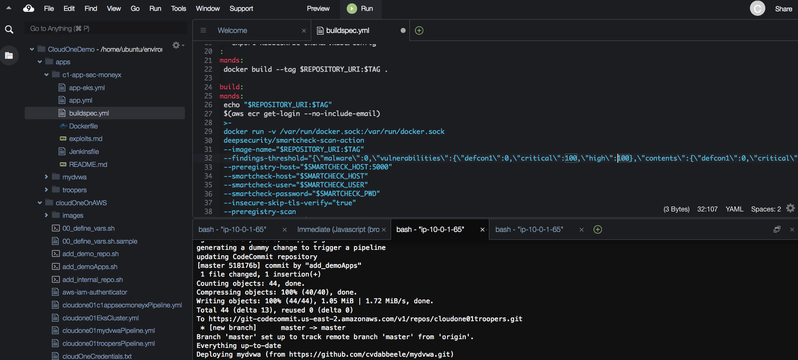


Now, commit and push the changes.

```shell
cd ~/apps/c1-app-sec-moneyx/                                  
git add . && git commit buildspec.yml -m "relaxed safety thresholds" && git push
```

While the pipeline is building;  
explore the buildspec.yaml and the Dockerfile

```shell
kubectl get pods -n smartcheck
kubectl get deployments -n smartcheck
kubectl get services -n smartcheck
kubectl get pods
```
Show the AWS CodeCommit Repository and the Pipeline as before
Show that now we have a successful pipeline and a deployment

By looking at the "AGE" column, you can see if any of the new apps got (re-)deployed.

```shell
markus:~/environment/apps/c1-app-sec-moneyx (master) $ kubectl get pods
NAME                              READY   STATUS    RESTARTS   AGE
c1appsecmoneyx-7d7c6944f5-vjjsb   1/1     Running   0          2m33s
troopers-6c6b4cc9cd-bv5qv         1/1     Running   0          4m56s
```

Maybe you need to repeat `kubectl get pods`, since building and deploying takes a couple of minutes.  
Show the Pipelines again and confirm that this time the cloudone01c1appsecmoneyxPipeline succeeded
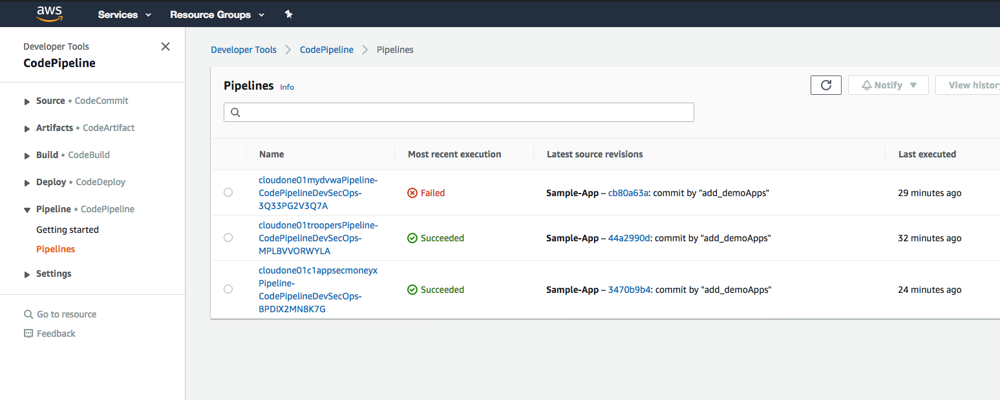

Walk through the scanresults in SmartCheck and notice that we still have a vulnerable image.


### Attack and Protect the running container
Now that we have the MoneyX app successfully deployed, get the URL and port (8080) of its service:
```shell
echo $(kubectl get svc c1appsecmoneyx -o jsonpath='{.status.loadBalancer.ingress[0].hostname}'):$(kubectl get svc c1appsecmoneyx -o jsonpath='{.spec.ports[0].port}')
```
login to the MoneyX app  
- username = "user"
- password = "user123"   

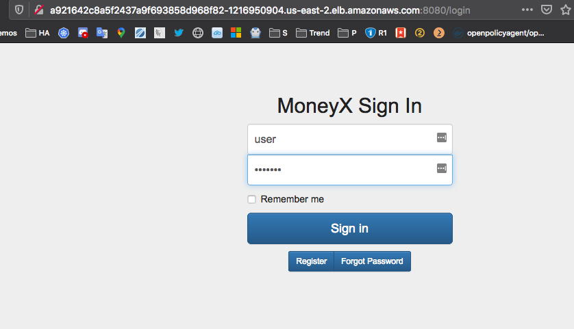


Go to Received Payments.    
You see no received payments.  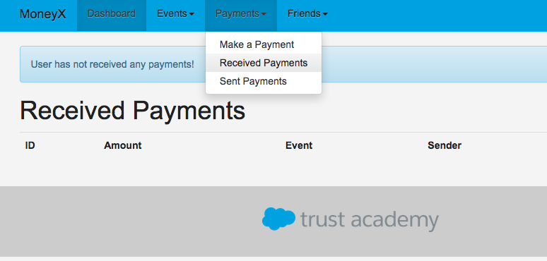


Go to the URL window at the top of the browser and add to the end of the url:  " or 1=1" (without the quotes)
e.g.

```url
http://a2baec90930634639a260c64b1be4b91-1290966830.eu-central-1.elb.amazonaws.com:8080/payment/list-received/3 or 1=1   
.    
```

You should now see ALL payments... which is bad
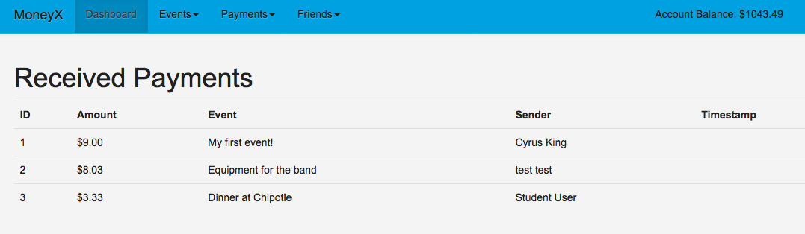

Go to <https://cloudone.trendmicro.com/application#/events> show that there is a security event for SQL injection
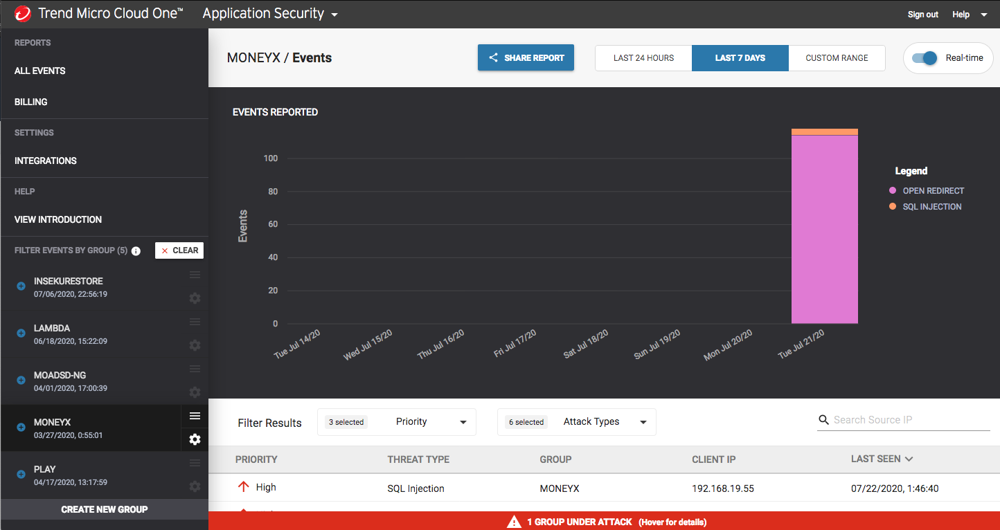
Check security events in CloudOne Application Security

Set the SQL Injection policy to MITIGATE
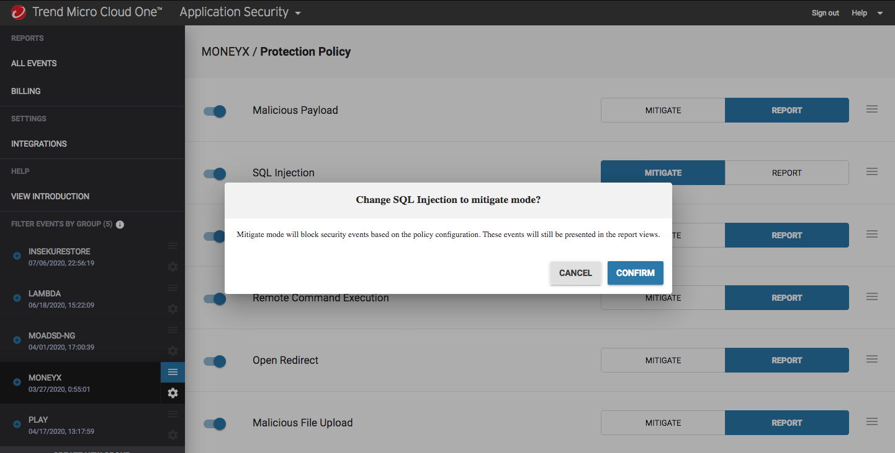
**important:**  
Open the SQL Injection Policy and ensure to have all subsections enabled.
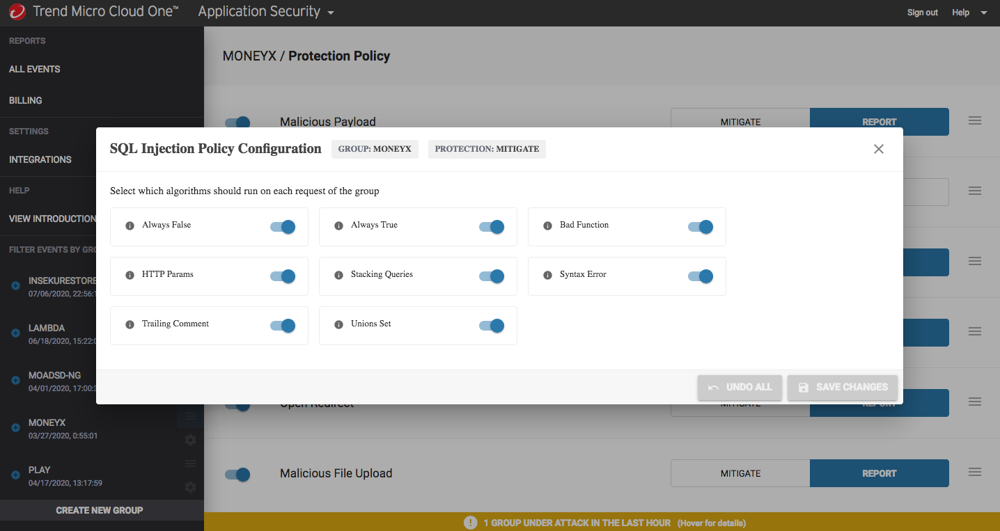

Run the SQL injection again  (just refresh the browser page)   You should get our sophisticated blocking page.
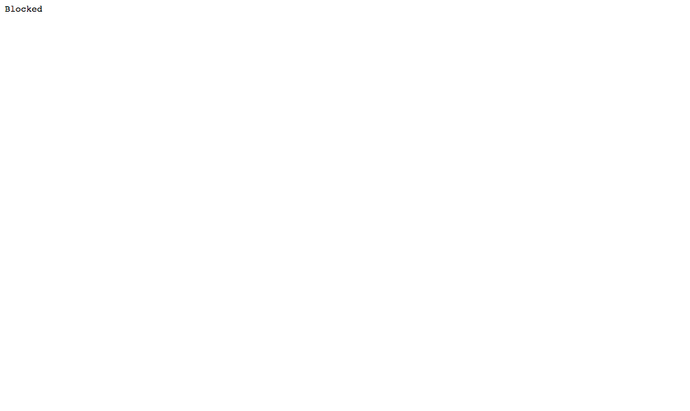


### Walk through the integration with CloudOne Application Control

In AWS codecommit: show the Dockerfile
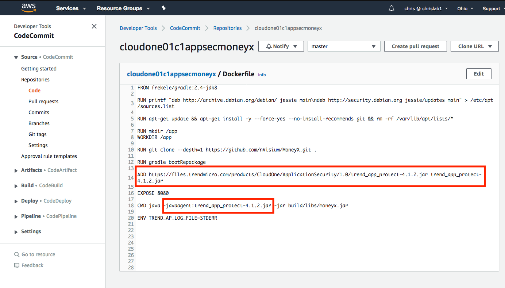

point out:
- ADD command: this is where we import the library in our app (in this case it is a java app, so we added a java library)
- CMD command: this is where the app will get started and our library will be included.  Here we invoke the imported library

The Registration keys for CloudOne Application Security must be called per running instance, at runtime.  You can show those in the AWS Cloud Formation Template -> Tab:Template ->search appSec registration keys for AppSec
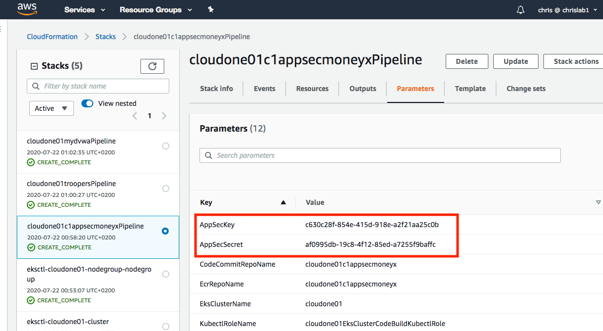

## Walk through CloudOne Container Security (Admission Control)
- go to the CloudOne Container Security web interface and show the Admission Policy.  
  Point out that we will not be able to deploy containers directly pulled from gcr.io (this is just an example).  Also pods that have not been scanned will not be allowed to run
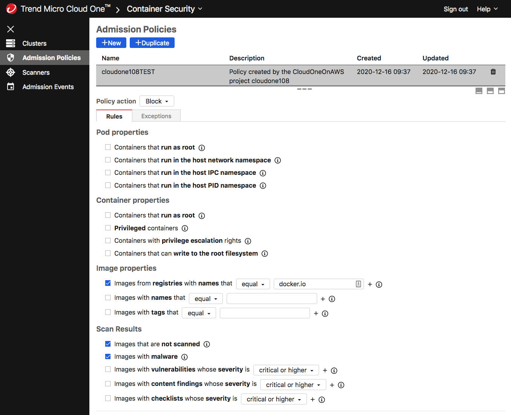
Demonstrate this by trying to start an nginx pod, right from dockerhub
```
kubectl run --generator=run-pod/v1 --image=nginx --namespace nginx nginx
```
This will not be allowed and will generate the following error:    
```
Error from server: admission webhook "trendmicro-admission-controller.c1cs.svc" denied the request: 
- unscannedImage violated in container(s) "nginx" (block).
```
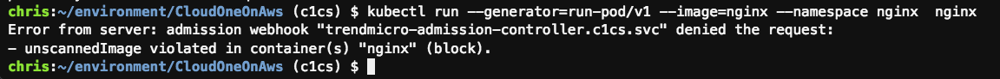  

Show the Admission Events in the WebUI:
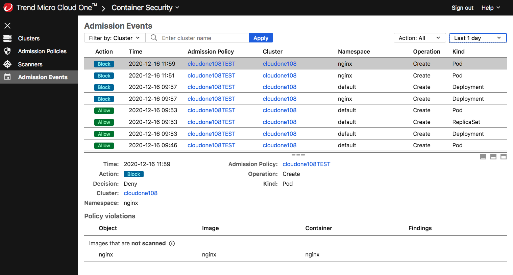

- Whitelist a namespace and deploy nginx in that namespace
```
kubectl create namespace mywhitelistednamespace
#whitelist that namespace for C1CS
kubectl label namespace mywhitelistednamespace ignoreAdmissionControl=ignore
#deploying nginx in the "mywhitelistednamespace" will work:
kubectl run --generator=run-pod/v1 --image=nginx --namespace mywhitelistednamespace nginx

kubectl run nginx  --image=nginx --namespace mywhitelistednamespace
kubectl get namespaces --show-labels
kubectl get pods -A | grep nginx
```