# How to Demo
Update 5 Feb 2021
- [How to Demo](#how-to-demo)
  - [Prepare for the Demo](#prepare-for-the-demo)
    - [1. Configure the Cloud One Application Security policies for MoneyX](#1-configure-the-cloud-one-application-security-policies-for-moneyx)
    - [Start two extra pipeline-instances of MoneyX](#start-two-extra-pipeline-instances-of-moneyx)
    - [Ensure to have the following browser tabs opened and authenticated.](#ensure-to-have-the-following-browser-tabs-opened-and-authenticated)
  - [Security Gates for CI/CD pipelines](#security-gates-for-cicd-pipelines)
  - [Demo AWS pipeline integrations with SmartCheck](#demo-aws-pipeline-integrations-with-smartcheck)
  - [First pipeline walkthrough: "Risky images are not pushed to the Registry"](#first-pipeline-walkthrough-risky-images-are-not-pushed-to-the-registry)
  - [Second pipeline walkthrough: Demo runtime protection by CloudOne Application Security (C1AS)](#second-pipeline-walkthrough-demo-runtime-protection-by-cloudone-application-security-c1as)
    - [Attack and Protect the running container](#attack-and-protect-the-running-container)
    - [Walk through the integration with CloudOne Application Security](#walk-through-the-integration-with-cloudone-application-security)
  - [Third pipeline walk through: Demo CloudOne Container Security (Admission Control)](#third-pipeline-walk-through-demo-cloudone-container-security-admission-control)
    - [- Where did this malware come from?](#--where-did-this-malware-come-from)
  - [Deploy a "rogue" container](#deploy-a-rogue-container)

## Prepare for the Demo

In this demo scenario we will be using the MoneyX demo application. `This is the only app that has the runtime protection enabled`.

### 1. Configure the Cloud One Application Security policies for MoneyX  
- login to your CloudOne account (${C1URL}/ ) 
- go to `Application Security`.  
- in the left margin, find the group that you created for the MoneyX application (`c1-app-sec-moneyx`)
- enable all policies and set them to REPORT

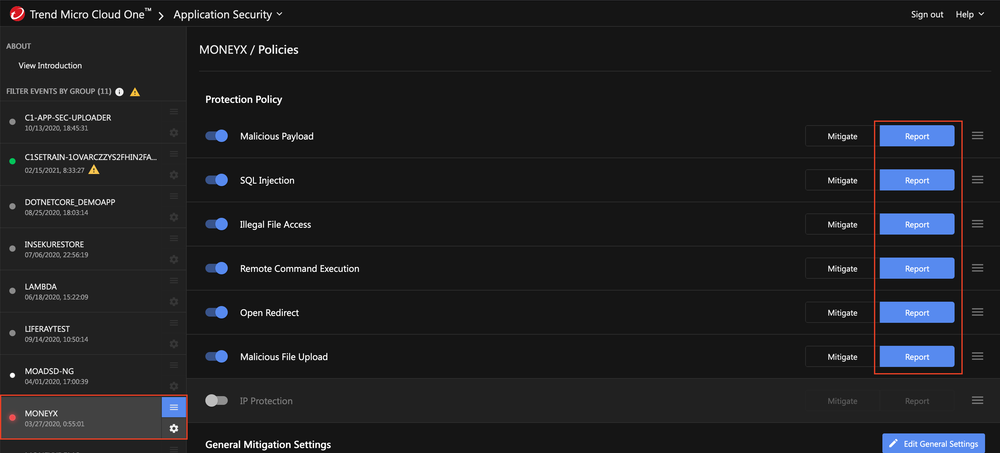


### Start two extra pipeline-instances of MoneyX 
When we will demo, we want to have 3 MoneyX pipeline-instances available, each with different settings.  
The first pipeline-instance of MoneyX is built automatically by the deployment.  
Verify its status in the AWSconsole -> Services -> CodePipeline -> `Pipelines` -> `{C1PROJECT}c1appsecmoneyxPipeline-CodePipelineDevSecOps-.....`  
Once the initial MoneyX pipeline has finished, kick of a second deployment by running the  **pushWithHighSecurityThresholds.sh** script in your Cloud9 environment
```shell
./pushWithHighSecurityThresholds.sh
```
Again, check if the pipeline starts (this may take a minute).  
Wait until it has completed.    
Once it has completed, kick off a third pipeline by running the  **pushWithMalware.sh** script
```shell
./pushWithMalware.sh
```
You should now have 3 pipeline instances of MoneyX  
To see the pipeline history (which you will need in the demo), go to AWSconsole -> Services -> CodePipeline -> `Pipelines` -> `{C1PROJECT}c1appsecmoneyxPipeline-CodePipelineDevSecOps-.....` -> now in the left margin, under pipelines, a new item `History` should appear (see screenshot)  
Click it to see the 3 pipeline-intances on the MoneyX app

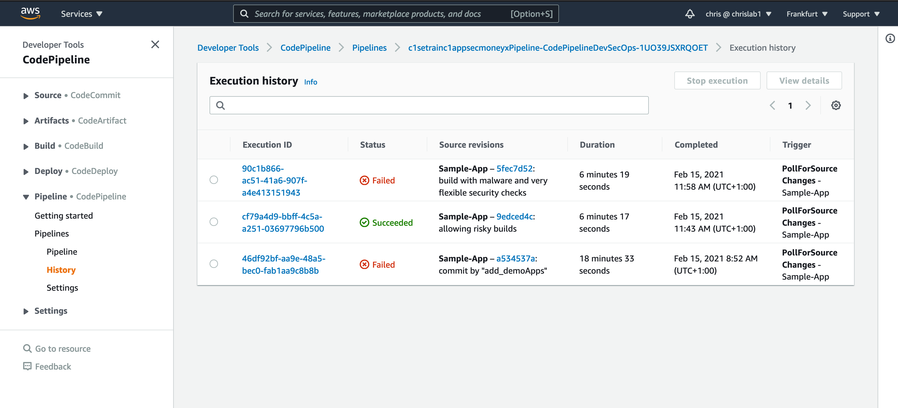


### Ensure to have the following browser tabs opened and authenticated.

- CloudOne Application Security  (${C1ASAPIURL})
- SmartCheck (to find the URL, in your Cloud9 shell, type: `kubectl get services -n smartcheck` and look for the `proxy` service)
- AWS Service CodePipeline / CodeCommit
- Your Cloud9 shell
<br/><br/> 
<br/><br/>      

## Security Gates for CI/CD pipelines  
The core of any DevOps environment is the CI/CD pipeline.
In this demo we will show the following security gates  
  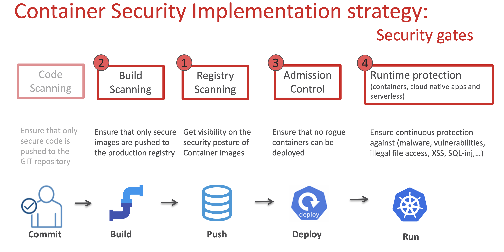  
The Code Scanning gate may be added later.  It is/will be, based on our collaboration with Syk 


## Demo AWS pipeline integrations with SmartCheck

- Show the EKS cluster  
  In Cloud9 type:
```shell
eksctl get clusters
kubectl get nodes
```
Or in the AWS console, go to EKS and show the cluster  
Mention that in this demo setup we have 2 worker nodes  
 

- Show the pods used by smartcheck
```shell
kubectl get pods --namespace smartcheck
```  
- Point out when we say that we "scan" an image, we actually have 5 different scanners scanning the image for for specific things  
```shell
kubectl get pods --namespace smartcheck | grep -i scan
```
  

- Also show the deployments
```shell
kubectl get deployments -n smartcheck
```
    Deployments ensure that always a given number of instances of each pod is running (in our case this default is 1) but this can be scaled by the usual kubernetes commands.


- If (optionally) you want to dive a little deeper you can:  
  - also show that we enforce microsegmentation between the pods.   
  Show the network policies:
    ```shell
    kubectl get networkpolicies -n smartcheck
    ```  
    for example, for the proxy pod we have the following network policy  
    Also good to show is the network policy for the database pod  
    Show the ingress and the port 5432  
  
    ```Shell
    kubectl describe networkpolicy db -n smartcheck
    ```
- point out that SmartCheck is deployed using a helm chart with one, single, command.   
  To check the version of the deployed SmartCheck, run:   
  ```shell
  helm list -n $DSSC_NAMESPACE
  ```    
  To deploy smartcheck, one would only run:  
  ```shell
  helm install -n $DSSC_NAMESPACE --values overrides.yml deepsecurity-smartcheck https://github.com/deep-security/smartcheck-helm/archive/master.tar.gz
    ```
    To upgrade smartcheck, one would only run:   
    ```shell
    helm install -n $DSSC_NAMESPACE --values overrides.yml deepsecurity-smartcheck https://github.com/deep-security/smartcheck-helm/archive/master.tar.gz
    ```   

- To find the SmartCheck URL, we need to get the "services".  
  Type:
  ```shell
  kubectl get svc -n smartcheck 
  ```
  or more detailed:
   ```shell
  kubectl get svc -n smartcheck proxy  -o jsonpath='{.status.loadBalancer.ingress[0].hostname}'
  ```
  and open a browser to that url
  (e.g. <https://afa8c13bf2497469ba8411dfa1cfebec-1286344911.eu-central-1.elb.amazonaws.com>)

- Login to SmartCheck with the username/password that you have defined in the 00_define_vars.sh file and show/discuss:
  - the Smart Check dashboard
  - the connected registries and point out how easy it is to add a registry and get full visibility on the security posture of the container-images (you only need the url and credentials with Read-Only rights)
  - the scanfindings
    - show that we scan for malware, vulnerabilities, content and 

- Show the 3 AWS CodeCommit repositories (AWS -> Services -> CodeCommit -> Repositories) 

- Show the AWS pipelines (on the same page: Pipeline -> Pipelines)  
  select the moneyX pipeline and click on the `View History` tab/button on top of the page
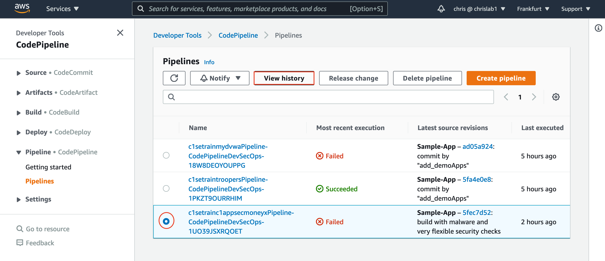

## First pipeline walkthrough: "Risky images are not pushed to the Registry"
- (this is the pipeline at the top of the list)
- Click on the Execution ID of the pipeline that say `commit by "add_demoApps"` for Source revisions
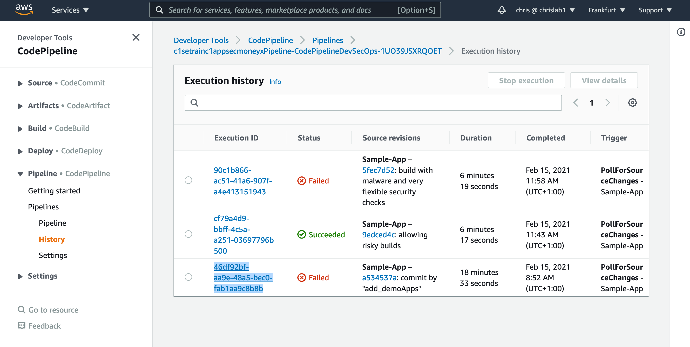
- Click on the `Link to execution ID` to open the log file of the pipeline-instance
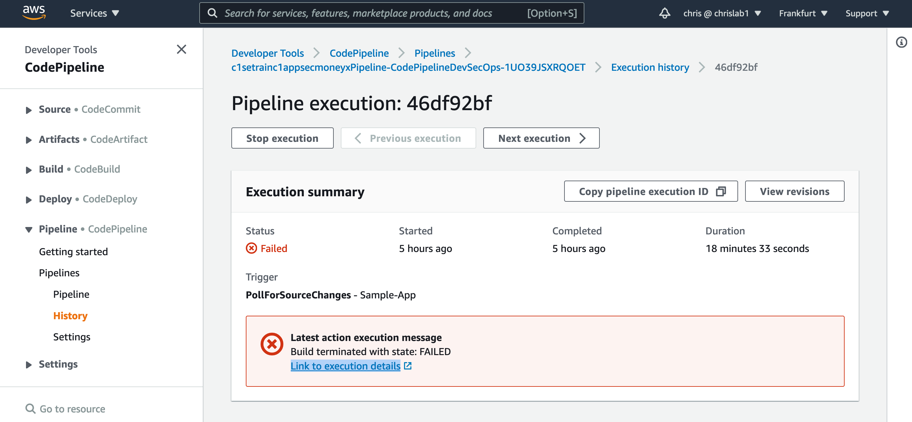
- scroll all the way down
- show where the smartcheck-scan-action container is started

- show where the pipeline is waiting for the can results
 
- and SmartCheck is scanning the container-image: 
- walk through the scan results

- and specifically point out the Snyk Java scan results.  This is something that will not show up in e.g. the Clair Open Source scanner

- show why this pipeline failed (see "Vulnerabilities exceeded threshold" in screenshot below)   
- **The above integration ensures that only "clean" images can get published in our ECR registry**


## Second pipeline walkthrough: Demo runtime protection by CloudOne Application Security (C1AS)
Story: We have to deploy with vulnerabilities
- *For an urgent Marketing event, the "business" wants us to put this application online ASAP.  
  Our code is fine, but we have found vulnerabilities in the external libraries that we have used and we don't know how to quickly fix them (or the fixes are not yet available).*  
Story:  A rogue developer has set all thresholds to 300 in an attempt to get his image published

Luckilly we have also deployed runtime protection in the app, using CloudOne Application Security
- Click on the Execution ID of the pipeline that says `allowing risky builds` for Source revisions
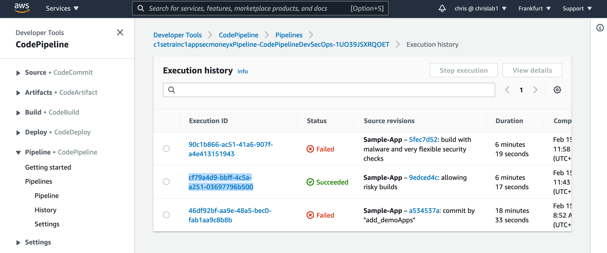
- Select the  `Visualization` tab
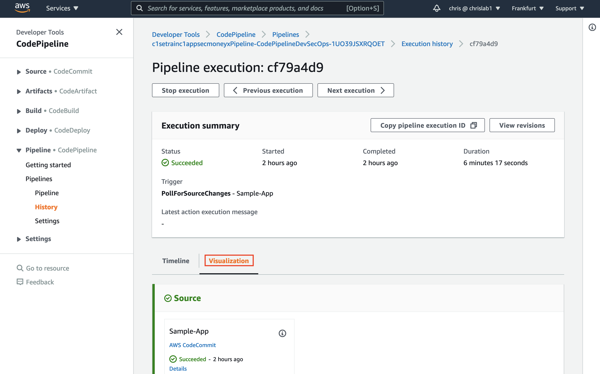  
- scroll down on to the bottom of that page and click on the `Details` link under the `BuildAndAcan` section (make sure to click the Details under the BuildAndScan section, not the Details under the Source section)  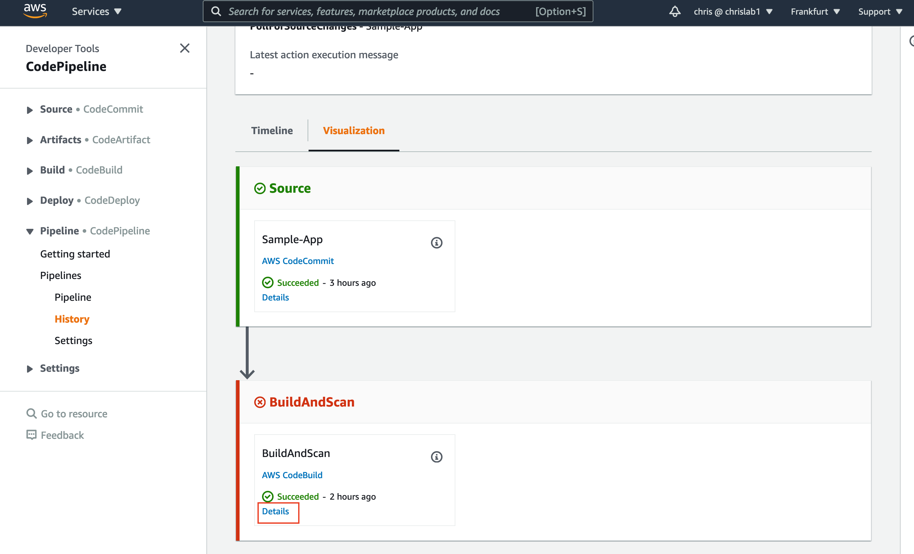 

- scroll all the way down and show where the smartcheck-scan-action container is started and point out that a developer has set all thresholds to 300, in order to get his image published
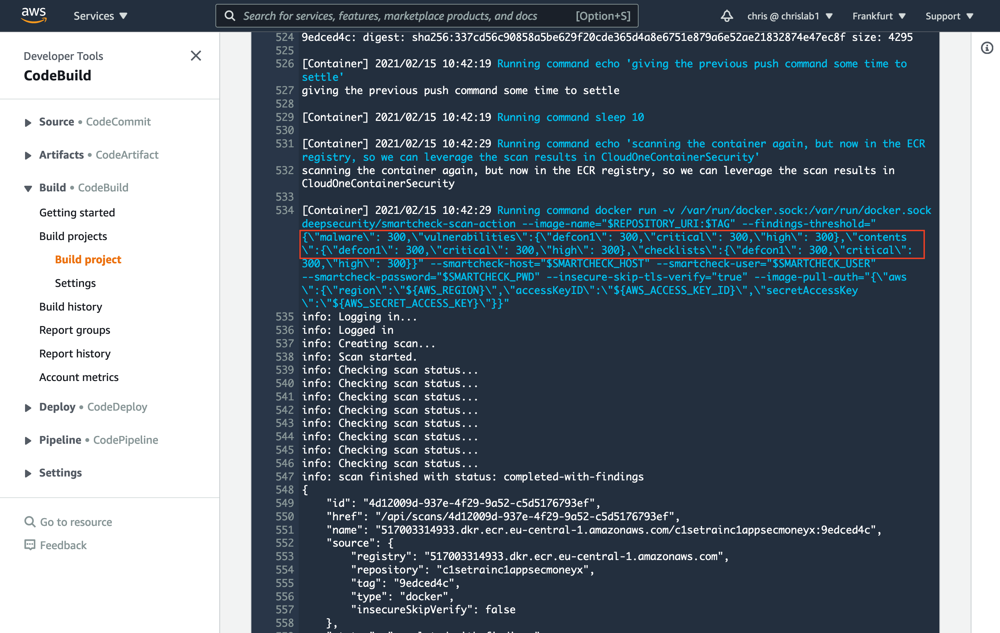 

- In smartcheck find the scan and notice that we still have a vulnerable image

- Show that this pipeline continued till the end and it has deployed a vulnerable container 
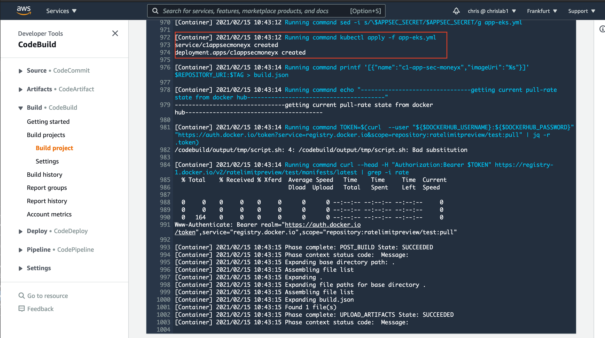 

- show the deployment in the Cloud9 shell
   ```shell
   cd ~/environment/apps/c1-app-sec-moneyx/
   kubectl get pods 
   kubectl get deployments 
   kubectl get services 
   ```
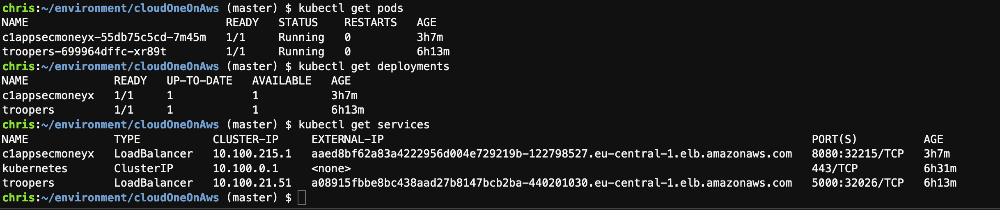 

- find the service URL of c1appsecmoneyx and open it in a browser on `port 8080`
### Attack and Protect the running container
Another way to get the URL and port (8080) of the c1appsemoneyx service:
```shell
echo $(kubectl get svc c1appsecmoneyx -o jsonpath='{.status.loadBalancer.ingress[0].hostname}'):$(kubectl get svc c1appsecmoneyx -o jsonpath='{.spec.ports[0].port}')
```
Open the c1appsecmoneyx URL in a browser, on HTTP (not HTTPS) on port 8080  
Login to the MoneyX app  
- username = "user"
- password = "user123"   


Go to Received Payments.    
You see no received payments.  


Go to the URL window at the top of the browser and add to the end of the url:  " or 1=1" (without the quotes)
e.g.

```url
http://a2baec90930634639a260c64b1be4b91-1290966830.eu-central-1.elb.amazonaws.com:8080/payment/list-received/3 or 1=1   
.    
```

You should now see ALL payments... which is bad


Go to <${C1ASAPIURL}#/events> show that there is a security event for SQL injection

Check security events in CloudOne Application Security

Set the SQL Injection policy to MITIGATE

**important:**  
Open the SQL Injection Policy and ensure to have all subsections enabled.


Run the SQL injection again  (just refresh the browser page)   You should get our sophisticated blocking page.


### Walk through the integration with CloudOne Application Security

In AWS codecommit: show the Dockerfile


Point out:
- ADD command: this is where we import the library in our app (in this case it is a java app, so we added a java library)
- CMD command: this is where the app will get started and our library will be included.  Here we invoke the imported library

The Registration keys for CloudOne Application Security must be called per running instance, at runtime.  You can show those in the AWS Cloud Formation Template -> Tab:Template ->search appSec registration keys for AppSec


 
## Third pipeline walk through: Demo CloudOne Container Security (Admission Control)
- (this is the pipeline at the top of the list)
- As before, from the AWS console, go to Services -> CodePipeline -> Pipelines -> select the moneyX pipeline (select it, don't click it) -> click on `View History` -> and this time open the pipeline-instance that has `build with malware and very flexible security checks` as the Source revisions.  Point out that this pipeline failed and "let's investigate why it failed"
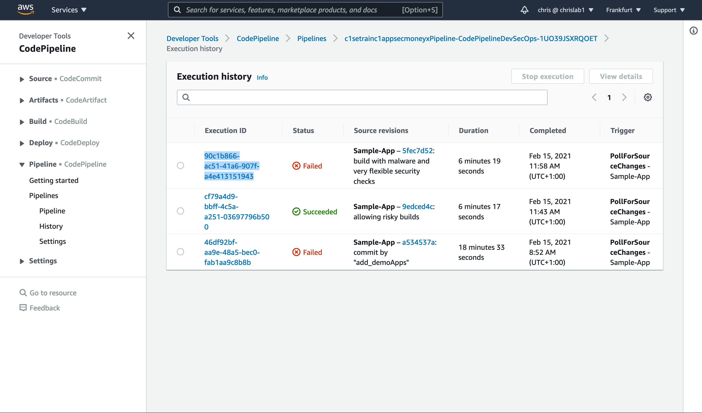
- On Pipeline execution:xxxxxxxx page, click on the `Link to execution details` link 
  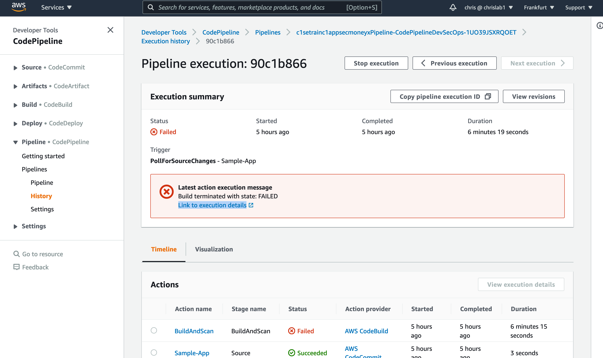  
- and scroll all the way down
- show that that the Admission Controller (=Cloud One Container Security) prevented the deployment of this image because during an earlier scan, SmartCheck scanner had found malware in this image
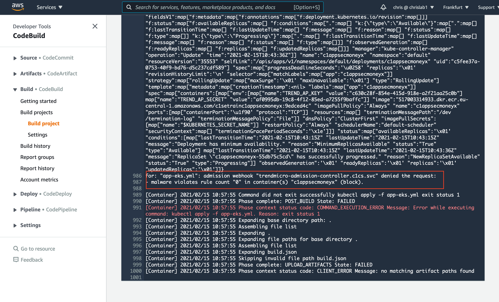
- find that scan in SmartCheck.  It should have a blue icon next to it.
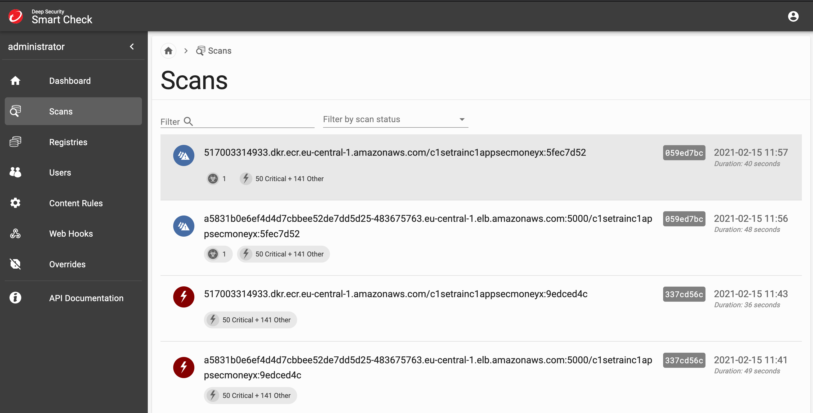
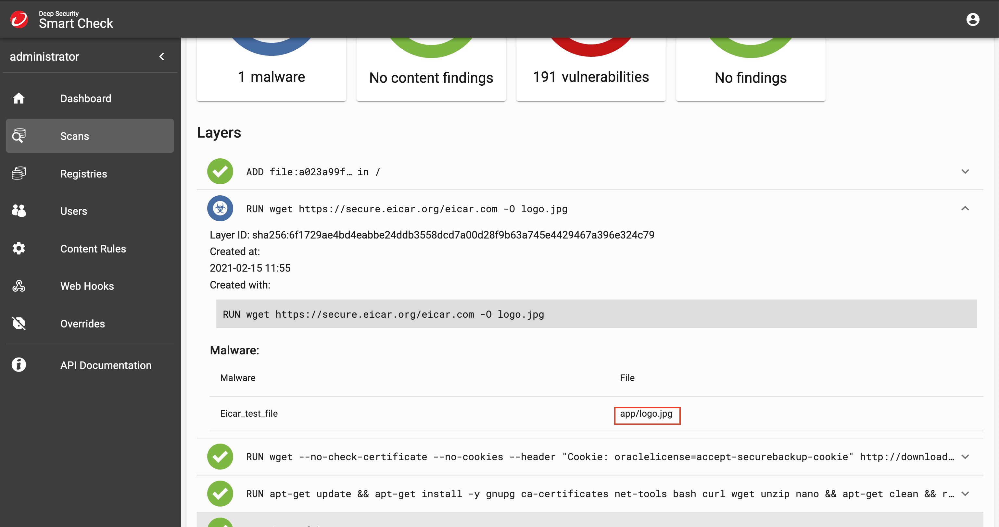
- go to the CloudOne Container Security web interface and show the Admission Policy.  
  Point out that this policy prevents any container with malware from starting.  
  This is the reason why this pipeline-instance was not able to deploy this newer version of MoneyX

<br/><br/> 
<br/><br/>      

### - Where did this malware come from?  
- Let's trace it back to the Dockerfile  
  In the AWS console, return to this pipeline-instance (Services -> CodePipeline -> Pipelines -> select the moneyX pipeline (select it, don't click it) -> click on View History -> and find the build that says: `build with malware and very flexible security checks`  )
- Click on the build number in that text
  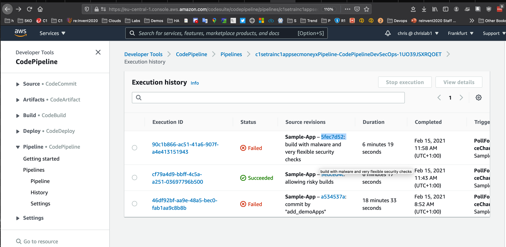
- This will bring you to that specific commit in CodeCommit
- Click on `Browse` to see the files from this commit
  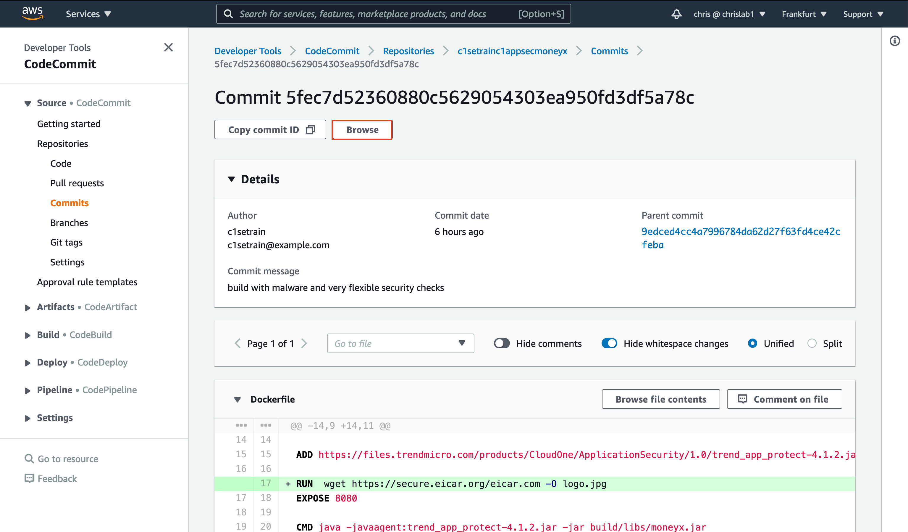
- and open the `Dockerfile`
  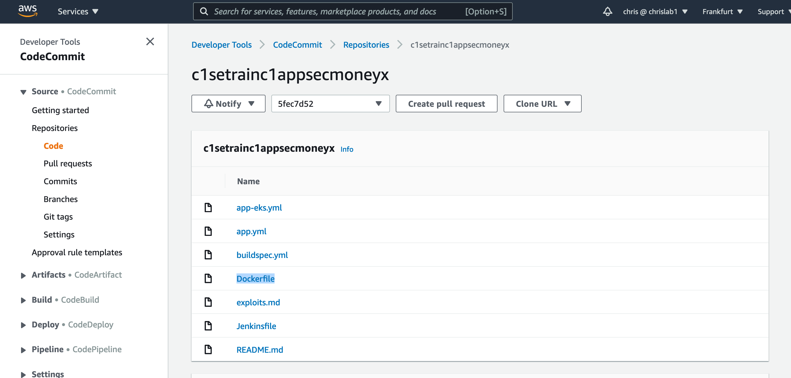
- aha! someone added a logo.jpg to the image and it contained malware
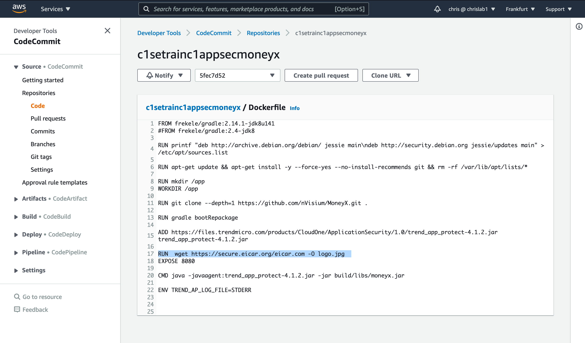

- we have done a full cirle now

## Deploy a "rogue" container
- In our CloudOne Container Security, we had also set a rule to `block unscanned images`    So, let's try to deploy a container that did not go through the pipeline.  

- go to the CloudOne Container Security web interface and show the Admission Policy.  
  Point out that we have enabled:
  -  a rule to block any containers that were not build through our pipeline and were not scanned by SmartCheck
  -  another rule that blocks containers that are pulled directly from docker.io (this is just an example).  

- Demonstrate this by trying to start an nginx pod, straight from dockerhub
```shell 
kubectl run  --image=nginx --namespace nginx nginx
```
- This will not be allowed and will generate the following error:    
```
Error from server: admission webhook "trendmicro-admission-controller.c1cs.svc" denied the request: 
- unscannedImage violated in container(s) "nginx" (block).
```
  

- Show the Admission Events in the WebUI:


- Whitelist a namespace and deploy nginx in that namespace
```
kubectl create namespace mywhitelistednamespace 
#whitelist that namespace for C1CS
kubectl label namespace mywhitelistednamespace ignoreAdmissionControl=ignore
#deploying nginx in the "mywhitelistednamespace" will now work:
kubectl run  --image=nginx --namespace mywhitelistednamespace nginx

kubectl run nginx  --image=nginx --namespace mywhitelistednamespace
kubectl get namespaces --show-labels
kubectl get pods -A | grep nginx
```


  